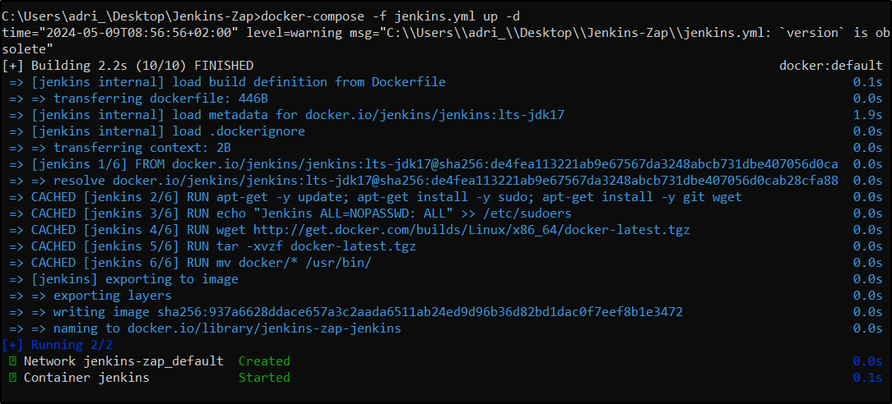
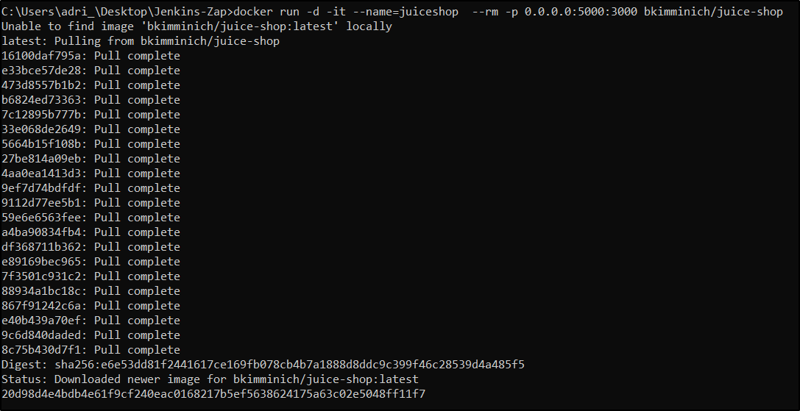
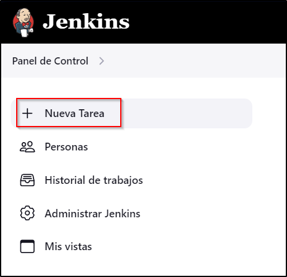
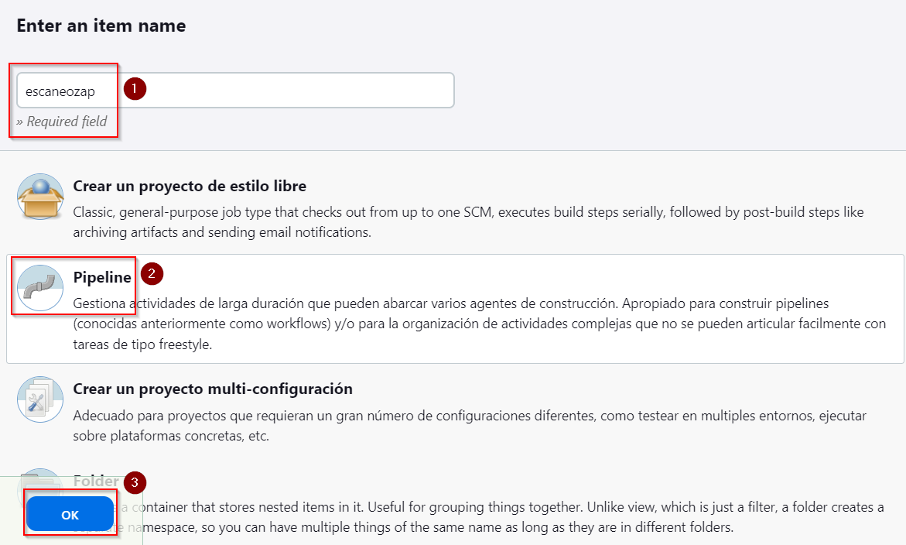
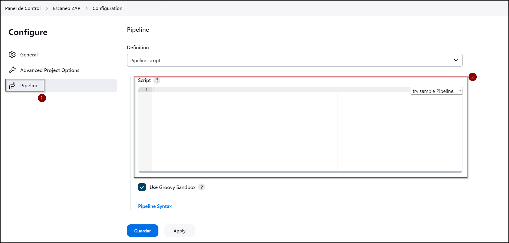
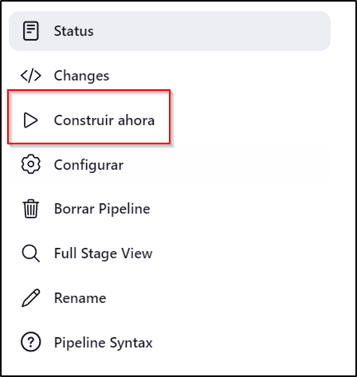
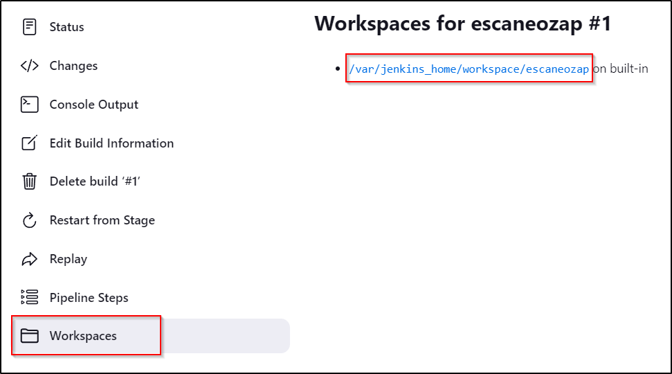
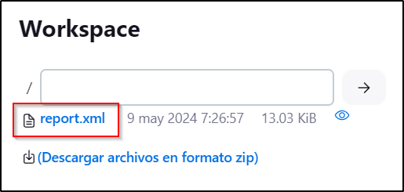

# PPS Jenkins - Escaneo ZAP

Pretendemos montar un entorno automatizado de testeo mediante Jenkins. Este se basará en realizar un escaneo con OWASP automatizado y que el reporte nos lo envíe a nuestro servicio Jenkins. 

Toda esta práctica se realizará en Docker.

### Preparación del entorno

Para empezar esta práctica, lo primero que debemos realizar es el despliegue de Jenkins. Esto lo realizaremos desplegando el Docker con el siguiente comando:



Fichero de despliegue Jenkins.

```yaml
version: '3.9'

services:
  jenkins:
    build:
      dockerfile: Dockerfile
      context: .
    container_name: jenkins
    restart: always
    privileged: true
    user: root

    healthcheck:
      test: curl -s https://localhost:8080 >/dev/null; if [[ $$? == 52 ]]; then echo 0; else echo 1; fi
      interval: 1m
      timeout: 5s
      retries: 3
      

    ports:
      - '8080:8080'
      - '50000:50000' 
    networks:
      - default
    volumes:
      - '/docker/jenkins/jenkins_home:/var/jenkins_home'
      - '/var/run/docker.sock:/var/run/docker.sock'
      - '/jenkins-data:/var/jenkins_home'
      - '/jenkins-home:/var/jenkins_home'
networks:
  default:
```

Fichero Dockerfile.

```docker
# https://github.com/jenkinsci/docker/blob/master/README.md
FROM jenkins/jenkins:lts-jdk17

USER root

# install docker cli
RUN apt-get -y update; apt-get install -y sudo; apt-get install -y git wget
RUN echo "Jenkins ALL=NOPASSWD: ALL" >> /etc/sudoers
RUN wget http://get.docker.com/builds/Linux/x86_64/docker-latest.tgz
RUN tar -xvzf docker-latest.tgz
RUN mv docker/* /usr/bin/

USER Jenkins
```

Una vez tenemos desplegado nuestro Juice, lo siguiente será el despliegue de Docker a escanear, para esta práctica hemos utilizado un Docker de JuiceShop.



### Creación de tarea pipeline

Dentro de nuestro Jenkins, en el menú lateral izquierdo, seleccionamos nueva tarea.



Dentro de la creación tenemos que realizar los siguientes pasos:

1. Nombre de la tarea
2. Indicamos que queremos crear un pipeline
3. Seleccionamos OK para continuar.



Ahora dentro del aparatado pipeline, copiaremos el código de nuestro pipeline.



Ahora le mostraremos el código de nuestro pipeline comentado con lo que hace cada “stage” del mismo:

```groovy
pipeline {
    agent any
    stages {
        // Esta etapa verifica si el contenedor 'owasp' está en ejecución y lo detiene y elimina si es así.
        stage('Verificar y limpiar contenedor') {
            steps {
                script {
                    sh """
                        if [ \$(docker ps -q -f name=^owasp\$) ]; then
                            echo "El contenedor 'owasp' está corriendo. Deteniéndolo y eliminándolo..."
                            docker stop owasp
                            docker rm owasp
                        elif [ \$(docker ps -aq -f name=^owasp\$) ]; then
                            echo "El contenedor 'owasp' existe pero no está corriendo. Eliminándolo..."
                            docker rm owasp
                        else
                            echo "El contenedor 'owasp' no existe."
                        fi
                    """
                }
            }
        }
        // Esta etapa configura los parámetros para el escaneo, como el tipo de escaneo, el objetivo, la generación de informes, etc.
        stage('Configuro parámetros') {
            steps {
                script { 
                    properties([
                        parameters([
                            choice (
                                choices: ["Baselines", "APIS", "Full"],
                                description: "Tipo de escaneo",
                                name: "SCAN_TYPE"
                            ),
                            string (
                                defaultValue: "http://172.17.0.2:3000/",
                                description: "Objetivo del escaneo",
                                name: "TARGET"
                            ),
                            
                            booleanParam(
                                defaultValue: true, 
                                description: 'Genera reporte', 
                                name: 'GENERATE_REPORT'
                            ),
                            string (
                                defaultValue: "/tmp/reports/reportZAP",
                                description: "Ruta para guardar el informe",
                                name: "REPORT_PATH"
                            )
                            
                        ])
                    ])
                }
            }
        }
        // Esta etapa imprime la información de los parámetros utilizados en la ejecución del pipeline.
        stage("Pipeline Info") {
            steps {
                script {
                    echo"""
                    Parametros usados:
                        Tipo: $params.SCAN_TYPE
                        Objetivo: $params.TARGET
                        Informe: $params.GENERATE_REPORTS
                    """
                }
            }
        }
        // Esta etapa descarga y ejecuta el contenedor de ZAP necesario para realizar el escaneo.
        stage("Configuración del contenedor de ZAP") {
            steps {
                script {
                    echo "Pulling de la imagen de ZAP"
                    sh """
                        docker pull pixylweb/zap2docker-stable
                    """
                    echo "Arrancando el contenedor --> Start"
                    sh """
                        docker run -dt --name=owasp pixylweb/zap2docker-stable /bin/bash
                    """
                }
            }
        }
        // Esta etapa prepara el directorio de trabajo dentro del contenedor de ZAP.
        stage("Prepara el directorio de trabajo") {
            steps {
                script {          
                    sh """
                        docker exec owasp mkdir /zap/wrk
                    """
                }
            }
        }
        // Esta etapa realiza el escaneo del objetivo utilizando el contenedor de ZAP según el tipo de escaneo especificado.
        stage("Escanenando el objetivo usando el contenedor") {
            steps {
                script {
                    
                    scan_type="${params.SCAN_TYPE}"
                    echo "---> scan_type_ $scan_type"
                    target = "${params.TARGET}"
                    if(scan_type =="Baselines"){
                        sh """
                            docker exec owasp zap-baseline.py -t $target -x report.xml -i
                        """
                    }
                    else {
                        if(scan_type =="Full"){
                          sh """
                              docker exec owasp zap-full-scan.py -t $target -x report.xml -i
                          """
                         }
                         else {
                        echo "Se ha especificado un tipo de escaneo invalido."
                    }
                    }
                }
            }
        }
        // Esta etapa copia el informe generado dentro del contenedor de ZAP al directorio de trabajo del Jenkins.
        stage("Copiando el informe al directorio de trabajo") {
            steps {
                script{
                    sh """
                        docker cp owasp:/zap/wrk/report.xml ${WORKSPACE}/report.xml
                    """
                }
            }
        } 
        // Stage para eliminar OWASP después del escaneo
        stage('Eliminar OWASP') {
            steps {
                script {
                    sh """
                        if [ \$(docker ps -q -f name=^owasp\$) ]; then
                            echo "El contenedor 'owasp' está corriendo. Deteniéndolo y eliminándolo..."
                            docker stop owasp
                            docker rm owasp
                        elif [ \$(docker ps -aq -f name=^owasp\$) ]; then
                            echo "El contenedor 'owasp' existe pero no está corriendo. Eliminándolo..."
                            docker rm owasp
                        else
                            echo "El contenedor 'owasp' no existe."
                        fi
                    """
                }
            }
        }
    }  
}
```

Una vez terminado esto, pulsamos “Construir ahora” en el menú lateral izquierdo para comenzar el despliegue.



Podemos observar como se van completando las “stages” de nuestro proyecto.


Una vez completada la tarea, podemos irnos a la misma y dentro del workspace podemos encontrar el fichero de reporte ya copiado a nuestro servicio Jenkins.





Aquí tendríamos el archivo “report.xml” resultante del escaneo.


Una vez terminada la primera ejecución, el botón de “Construir ahora” pasará a ser “Build with Parameters”. Esto nos dejará cambiar el tipo de escaneo, la dirección IP del target e incluso dónde queremos guardar el reporte.


